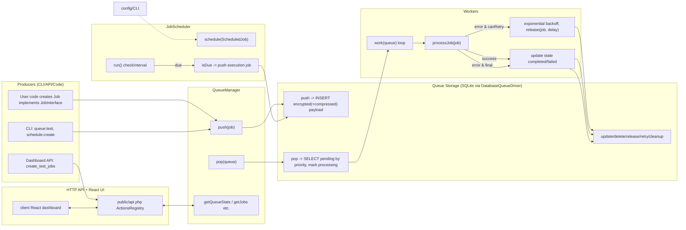
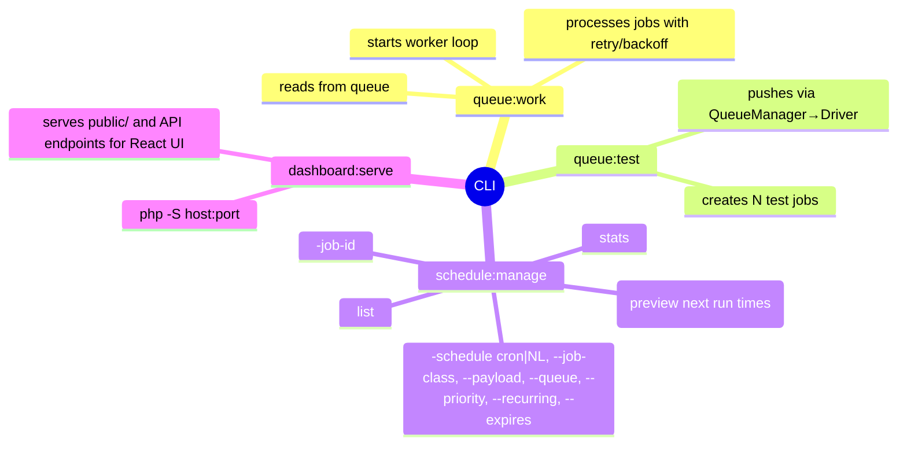
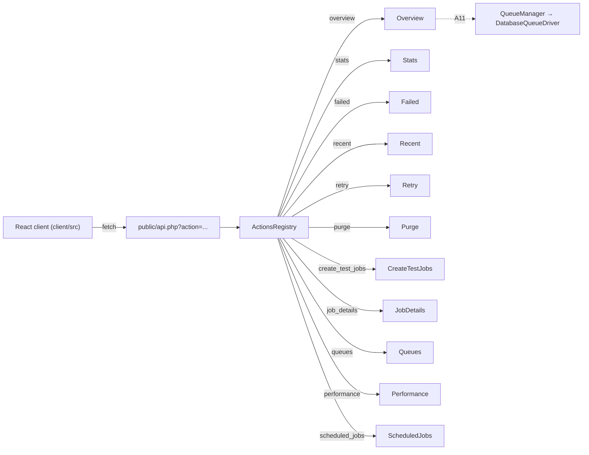

# System Architecture and Data Flow



## Worker Processing Lifecycle (Sequence)

```mermaid
sequenceDiagram
  autonumber
  participant Worker
  participant Driver as DatabaseQueueDriver
  participant Job
  Note over Worker: work(queue) loop
  Worker->>Driver: pop(queue)
  alt job available
    Driver-->>Worker: Job (state=processing)
    Worker->>Job: setState(processing); incrementAttempts()
    Worker->>Worker: setup timeout if configured
    Worker->>Job: handle()
    Worker->>Worker: pcntl_alarm(0)
    Worker->>Job: setState(completed); setCompletedAt()
    Worker->>Driver: update(job)
  else error thrown
    Worker->>Worker: pcntl_alarm(0)
    alt canRetry
      Worker->>Job: setState(retrying)
      Worker->>Driver: release(job, delay=2^attempts<=300)
    else final failure
      Worker->>Job: setState(failed); setFailedAt()
      Worker->>Driver: update(job) (kept for inspection)
    end
  end
```

## Scheduler Flow (Cron/Natural Language -> Dispatch)

```mermaid
flowchart TD
  NL["NaturalLanguageParser.parse('every 5 minutes' | 'at 3pm' | cron)"]
  CJ["CronExpression"]
  SJ["ScheduledJob (id, queue, priority, recurring, expires_at, tags)"]
  JS["JobScheduler"]
  DQ["DatabaseQueueDriver.push(executionJob)"]

  NL --> CJ
  CJ --> SJ
  SJ -->|schedule| JS
  JS -->|run loop (checkInterval=60s)| JS
  JS -->|isDue(now)| DQ
  JS -->|non-recurring| remove["unschedule(original)"]
  JS -->|recurring| updateNext["markAsRun + compute next_run_at"]
```

## CLI Overview (Commands and Flows)



## Dashboard/API Integration


